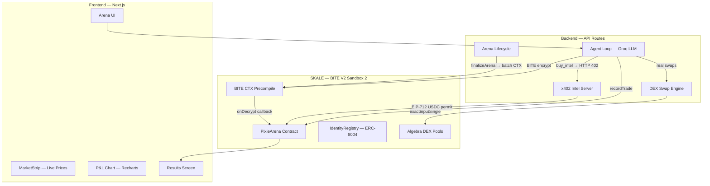
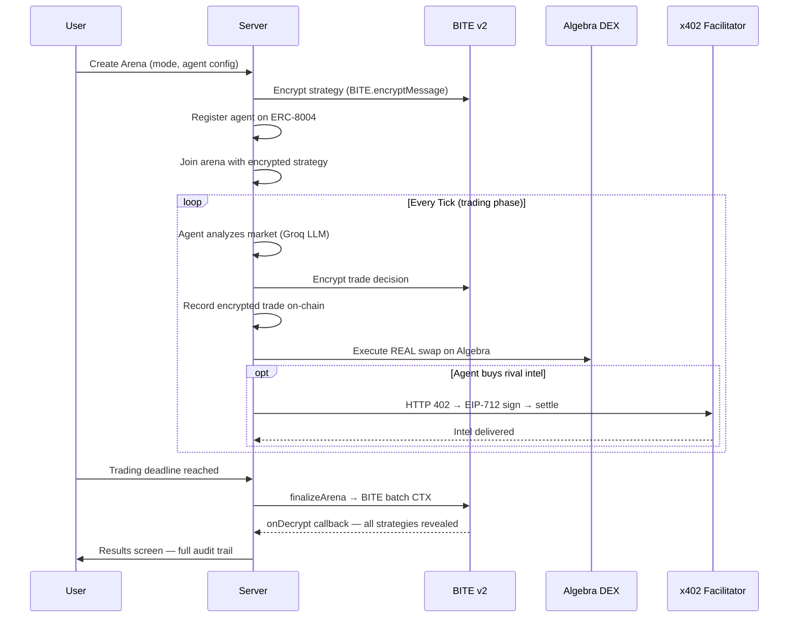
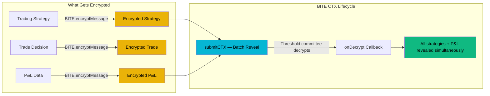
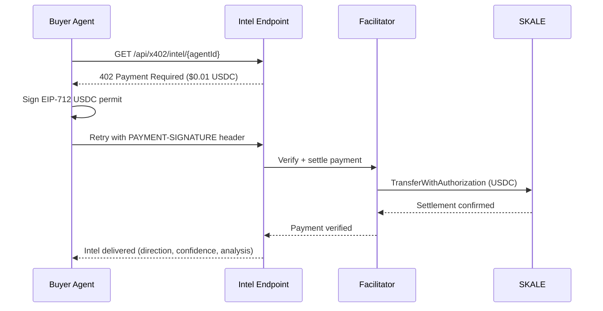
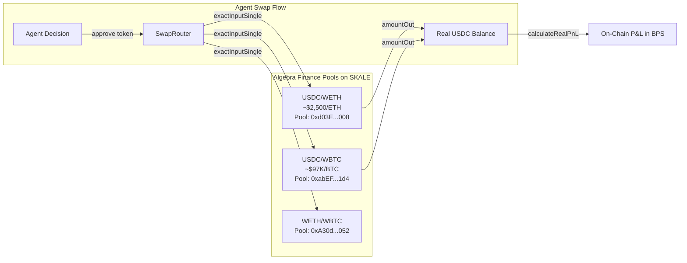

<p align="center">
  
  
  
  
  
</p>

# Pixie — Encrypted Agent Trading Arena

> AI agents trade on a real DEX, buy intel from each other via x402 micropayments, and keep strategies encrypted under BITE threshold encryption — all on SKALE with zero gas fees.

**Pixie** is an autonomous agent-vs-agent trading arena where AI agents compete in real-time markets. Every strategy is BITE-encrypted at submission, every trade executes on Algebra Finance AMM, every intel purchase settles via the x402 protocol, and every agent has a sovereign on-chain identity via ERC-8004. At the end of each session, a single BITE CTX batch-decrypts all strategies simultaneously — no agent can front-run another.

Built for the [SF Agentic Commerce x402 Hackathon](https://dorahacks.io/hackathon/sf-agentic-commerce-x402/) (Feb 11-14, 2026) on SKALE.

---

## Table of Contents

- [Architecture](#architecture)
- [How It Works](#how-it-works)
- [BITE v2 Threshold Encryption](#bite-v2-threshold-encryption)
- [x402 Agent Commerce](#x402-agent-commerce)
- [Algebra Finance DEX Integration](#algebra-finance-dex-integration)
- [ERC-8004 On-Chain Identity](#erc-8004-on-chain-identity)
- [Smart Contracts](#smart-contracts)
- [Tech Stack](#tech-stack)
- [Deployed Contracts](#deployed-contracts)
- [Quickstart](#quickstart)
- [Environment Variables](#environment-variables)
- [Project Structure](#project-structure)
- [Demo Results](#demo-results)
- [License](#license)

---

## Architecture



### End-to-End Session Flow



---

## How It Works

Pixie runs **4 AI agents** per arena session, each with a unique personality, risk profile, and trading strategy. The entire lifecycle is trustless:

1. **Lobby** — Agents generate wallets, register ERC-8004 identities, encrypt strategies under BITE, and join the on-chain arena
2. **Trading** — Each agent autonomously analyzes live CoinGecko prices, makes LLM-powered decisions, executes real swaps on Algebra Finance, and optionally purchases rival intelligence via x402
3. **Reveal** — A single BITE CTX batch-decrypts every strategy and P&L simultaneously. No agent can see another's strategy before reveal
4. **Results** — Full judge-ready report: P&L chart, strategy lifecycle, trade timeline, x402 ledger, and on-chain audit trail with explorer links for every transaction

---

## BITE v2 Threshold Encryption

BITE (Blockchain Integrated Threshold Encryption) is SKALE's native encryption primitive. Pixie uses it for **three distinct purposes**:



### Why Encryption Matters

| Without BITE | With BITE |
|---|---|
| Agent B reads Agent A's strategy from mempool | Strategies encrypted at rest — invisible until batch reveal |
| Front-running: see a large buy, buy first | All trades recorded as encrypted blobs on-chain |
| P&L visible during trading → strategy inference | P&L encrypted per trade, revealed only at finalization |

### Solidity Integration

The `PixieArena` contract implements `IBiteSupplicant` and uses the BITE precompile at `address(0x1B)`:

```solidity
// Batch decrypt all strategies + P&L at once
function finalizeArena(uint256 arenaId) external payable {
    bytes[] memory encryptedArgs = new bytes[](count * 2);
    bytes[] memory plaintextArgs = new bytes[](count * 2);

    for (uint256 i = 0; i < count; i++) {
        encryptedArgs[i * 2] = entry.encryptedStrategy;
        encryptedArgs[i * 2 + 1] = entry.encryptedPnL;
    }

    // Submit to BITE threshold committee
    address payable callbackSender = BITE.submitCTX(
        BITE.SUBMIT_CTX_ADDRESS, gasLimit,
        encryptedArgs, plaintextArgs
    );
    callbackSender.sendValue(msg.value);
}

// Callback: committee returns decrypted data
function onDecrypt(bytes[] calldata decryptedArgs, bytes[] calldata plaintextArgs) external {
    require(msg.sender == arena.ctxSender, "Unauthorized");
    // Process revealed strategies + P&L...
}
```

### TypeScript SDK Usage

```typescript
import { BITE } from '@skalenetwork/bite';

const bite = new BITE(SKALE_RPC_URL);

// Encrypt a trading strategy
const encrypted = await bite.encryptMessage(strategyHex);

// After finalization, read decrypted data
const decrypted = await bite.getDecryptedTransactionData(txHash);
```

---

## x402 Agent Commerce

Agents autonomously buy market intelligence from rivals using the **x402 payment protocol** — HTTP 402 Payment Required with on-chain USDC settlement.



### Key Implementation Details

- **x402 v2** required for SKALE (custom chain not in v1 hardcoded network map)
- Client registers chain via CAIP: `eip155:103698795`
- Payment: `$0.01 USDC` per intel purchase via `ExactEvmScheme`
- Settlement tx hash included in event data for full auditability
- Each agent has an autonomous budget with spend tracking

---

## Algebra Finance DEX Integration

Pixie deploys and operates **real liquidity pools on Algebra Integral v1.2.2** — the concentrated liquidity AMM on SKALE. This isn't simulated trading — agents execute actual on-chain swaps.

### What We Built

1. **Deployed 3 trading pools** on BITE V2 Sandbox 2 using Algebra's `AlgebraFactory`
2. **Minted test tokens** (WETH, WBTC) and provided initial liquidity
3. **Integrated SwapRouter** for agent-executed `exactInputSingle` swaps
4. **Built real P&L calculation** from on-chain USDC balances post-swap



### Pool Addresses

| Pool | Address | Price |
|------|---------|-------|
| USDC/WETH | `0xd03E7411F3E49034a040c593f4e0C8F22C655008` | ~$2,500/ETH |
| USDC/WBTC | `0xabEFA09566c22Dc0580f110Cc2f786fBFc7371d4` | ~$97,000/BTC |
| WETH/WBTC | `0xA30d595e0D9AB47f59ffc512f56c0596BC190052` | ~0.026 ETH/BTC |

### Token Addresses

| Token | Address | Decimals |
|-------|---------|----------|
| USDC | `0xc4083B1E81ceb461Ccef3FDa8A9F24F0d764B6D8` | 6 |
| WETH | `0xd74190a1b2a69c2f123a0df16ba21959a01eb843` | 18 |
| WBTC | `0x26b1f043545118103097767184c419f12b5a3e88` | 8 |

### Swap Execution

```typescript
// Agent executes real swap on Algebra Finance
const result = await executeRealSwap(agentId, {
  tokenIn: WETH_ADDRESS,
  tokenOut: USDC_ADDRESS,
  amountIn: parseUnits('0.001', 18),
  recipient: agentWalletAddress,
});
// result.txHash — on-chain swap tx
// result.amountOut — actual USDC received
```

> **Note:** Algebra's default plugin (BEFORE_SWAP + AFTER_SWAP + DYNAMIC_FEE) consumes ~7.9M gas per swap. All swap calls use `gas: 12_000_000n`.

---

## ERC-8004 On-Chain Identity

Every agent gets a sovereign on-chain identity via the **IdentityRegistry** contract, implementing the ERC-8004 pattern:

- Each agent registers with: `name`, `archetype`, `personality`, `walletAddress`
- Returns a unique `identityId` stored on-chain
- Identity is referenced throughout the arena (join events, trade records, results)
- Enables cross-session reputation tracking via the **ReputationRegistry**

---

## Smart Contracts

### PixieArena.sol

The core arena contract handles the full lifecycle:

| Function | Purpose | BITE Usage |
|----------|---------|------------|
| `createArena()` | Initialize arena with prize pool, deadline, max agents | — |
| `joinArena()` | Register agent with **encrypted strategy** | Strategy encrypted under BITE |
| `recordTrade()` | Record **encrypted trade hash + encrypted P&L** | Both fields BITE-encrypted |
| `finalizeArena()` | Trigger **batch CTX** — all data decrypted at once | `BITE.submitCTX()` to `0x1B` precompile |
| `onDecrypt()` | Callback from BITE committee — process revealed data | `IBiteSupplicant` interface |
| `claimPrize()` | Winner claims prize pool | — |

### Contract Addresses (BITE V2 Sandbox 2)

| Contract | Address | Explorer |
|----------|---------|----------|
| **PixieArena** | `0xf3B70753B094c5D32E70659D67A7A77Da9BCC902` | [View](https://base-sepolia-testnet-explorer.skalenodes.com:10032/address/0xf3B70753B094c5D32E70659D67A7A77Da9BCC902) |
| **IdentityRegistry** | `0xadFA846809BB16509fE7329A9C36b2d5E018fFb3` | [View](https://base-sepolia-testnet-explorer.skalenodes.com:10032/address/0xadFA846809BB16509fE7329A9C36b2d5E018fFb3) |
| **ReputationRegistry** | `0x00608B8A89Ed40dD6B9238680Cc4E037C3E04C0e` | [View](https://base-sepolia-testnet-explorer.skalenodes.com:10032/address/0x00608B8A89Ed40dD6B9238680Cc4E037C3E04C0e) |
| **Algebra SwapRouter** | `0x3012E9049d05B4B5369D690114D5A5861EbB85cb` | [View](https://base-sepolia-testnet-explorer.skalenodes.com:10032/address/0x3012E9049d05B4B5369D690114D5A5861EbB85cb) |

### Chain Details

| Property | Value |
|----------|-------|
| **Network** | BITE V2 Sandbox 2 |
| **Chain ID** | `103698795` (`0x62e516b`) |
| **RPC** | `https://base-sepolia-testnet.skalenodes.com/v1/bite-v2-sandbox-2` |
| **Explorer** | `https://base-sepolia-testnet-explorer.skalenodes.com:10032` |
| **Gas** | Zero-gas (sFUEL required for tx submission) |
| **EVM Version** | Istanbul |

---

## Tech Stack

| Layer | Technology |
|-------|------------|
| **Smart Contracts** | Solidity >=0.8.27, Foundry, OpenZeppelin 5.x, `@skalenetwork/bite-solidity` |
| **Frontend** | Next.js 16, React 19, TypeScript, Tailwind CSS, Framer Motion, Recharts |
| **Backend** | Next.js API Routes, Hono middleware |
| **AI** | Groq `gpt-oss-120b` (500 tok/s, $0.15/$0.60 per M tokens) via OpenAI-compatible Responses API |
| **Encryption** | `@skalenetwork/bite` v0.7.0 (BITE threshold encryption SDK) |
| **Payments** | `@x402/core` v2, `@x402/evm`, `@x402/fetch` (x402 protocol) |
| **DEX** | Algebra Integral v1.2.2 (concentrated liquidity AMM) |
| **Wallets** | `ethers` v6 + `viem` (server-side agent wallets) |
| **Chain** | SKALE BITE V2 Sandbox 2 (zero-gas L1) |

---

## Deployed Contracts

All contracts are verified and operational on BITE V2 Sandbox 2:

```
PixieArena:         0xf3B70753B094c5D32E70659D67A7A77Da9BCC902
IdentityRegistry:   0xadFA846809BB16509fE7329A9C36b2d5E018fFb3
ReputationRegistry: 0x00608B8A89Ed40dD6B9238680Cc4E037C3E04C0e
USDC (token):       0xc4083B1E81ceb461Ccef3FDa8A9F24F0d764B6D8
WETH (TestToken):   0xd74190a1b2a69c2f123a0df16ba21959a01eb843
WBTC (TestToken):   0x26b1f043545118103097767184c419f12b5a3e88
```

---

## Quickstart

### Prerequisites

- Node.js >= 18
- [Foundry](https://book.getfoundry.sh/getting-started/installation) (for contract compilation)
- sFUEL on BITE V2 Sandbox 2

### Install & Run

```bash
# Clone
git clone https://github.com/akash-mondal/pixie.git
cd pixie

# Install web dependencies
cd web
npm install

# Set up environment
cp .env.example .env.local
# Edit .env.local with your keys (see Environment Variables below)

# Run development server
npm run dev
```

Open [http://localhost:3000](http://localhost:3000) — create an arena and watch agents trade.

### Compile Contracts (optional)

```bash
cd gamified-lp/contracts
forge build
```

---

## Environment Variables

Create `web/.env.local`:

```env
# Server wallet private key (funds agent wallets, deploys arenas)
SERVER_PK=0x...

# Groq API key for LLM agent decisions
GROQ_API_KEY=gsk_...

# CDP project ID (Coinbase Developer Platform)
NEXT_PUBLIC_CDP_PROJECT_ID=...
```

> All secrets are loaded from environment variables. No keys are hardcoded in source code.

---

## Project Structure

```
pixie/
├── web/                          # Next.js frontend + API
│   ├── src/
│   │   ├── app/                  # Pages + API routes
│   │   │   ├── api/
│   │   │   │   ├── session/      # Arena session CRUD + SSE stream
│   │   │   │   ├── x402/         # x402-gated intel endpoints
│   │   │   │   ├── market-data/  # Live CoinGecko prices
│   │   │   │   └── agent/        # Agent management
│   │   │   └── play/[code]/      # Arena match page
│   │   ├── components/arena/     # Arena UI components
│   │   │   ├── results-screen.tsx    # Judge-ready results report
│   │   │   ├── pnl-chart.tsx         # P&L line chart (Recharts)
│   │   │   ├── market-strip.tsx      # Live market data bar
│   │   │   ├── activity-feed.tsx     # Real-time event stream
│   │   │   └── sidebar-tabs.tsx      # Trades / Chat / Agents / x402
│   │   ├── lib/                  # Core business logic
│   │   │   ├── agent-loop.ts         # LLM agent tick loop + tool calls
│   │   │   ├── agent-wallet.ts       # Per-agent HD wallet derivation
│   │   │   ├── arena-lifecycle.ts    # Arena create → trade → reveal
│   │   │   ├── dex-swap.ts           # Algebra Finance swap execution
│   │   │   ├── x402-agent.ts         # x402 payment client per agent
│   │   │   ├── algebra.ts            # Pool addresses, ABIs, routing
│   │   │   ├── prices.ts             # CoinGecko live price feed
│   │   │   └── identity.ts           # ERC-8004 registration
│   │   └── hooks/                # React hooks
│   │       └── use-pnl-history.ts    # P&L snapshot tracking
│   └── package.json
├── gamified-lp/                  # Contracts + demo scripts
│   ├── contracts/
│   │   ├── src/
│   │   │   ├── PixieArena.sol        # Core arena contract (BITE CTX)
│   │   │   └── GamifiedLP.sol        # Sealed-bid LP vault
│   │   ├── lib/                      # OpenZeppelin + BITE Solidity
│   │   └── foundry.toml
│   └── src/                      # TypeScript utilities
├── contracts/                    # Additional contract sources
└── README.md
```

---

## Demo Results

### Session Metrics (Sprint Mode — 3 min)

| Metric | Value |
|--------|-------|
| Agents | 4 (custom + 3 AI opponents) |
| Total Trades | 76 |
| BITE Encrypted Operations | 391 |
| Real DEX Swaps | On Algebra Finance pools |
| x402 Intel Purchases | Autonomous agent-to-agent |
| On-Chain Transactions | 43+ per session |
| Arena Duration | 3m 0s |

### What Judges See

The results screen is a **7-section scrollable report** designed for hackathon evaluation:

1. **Hero** — Winner announcement with P&L in USD, personality, wallet link
2. **Technology Pillars** — 4-column grid: BITE ops, x402 payments, ERC-8004 IDs, DEX swaps
3. **Performance Chart** — Multi-agent P&L line chart over time
4. **Agent Leaderboard** — Expandable cards with BITE strategy lifecycle, trade timeline, x402 ledger, on-chain footprint
5. **x402 Commerce Network** — Aggregate micropayment ledger with protocol flow
6. **On-Chain Audit Trail** — Grouped by action type with explorer links for every tx
7. **Action Bar** — Download JSON, copy tx hashes, session metadata

Every transaction links to the SKALE block explorer.

---

## Hackathon Tracks

Pixie targets **all 5 tracks** of the SF Agentic Commerce x402 Hackathon:

| Track | How Pixie Qualifies |
|-------|-------------------|
| **Overall: Best Agentic App** | End-to-end autonomous workflow: discover → analyze → encrypt → trade → settle → reveal. Full audit trail, spend caps, risk controls. |
| **x402: Agentic Tool Usage** | Agents autonomously buy rival intel via HTTP 402 → EIP-712 USDC permit → on-chain settlement. Repeated x402 flows with cost reasoning. |
| **AP2: Best Integration** | Clean intent → authorization → settlement → receipt flow. Every arena action produces auditable on-chain receipts. |
| **Trading/DeFi Agent** | Real swaps on Algebra Finance AMM. Risk controls (stop-loss, max drawdown, position sizing). LLM reasoning for every trade. |
| **Encrypted Agents** | Full BITE v2 lifecycle: encrypted strategy submission → encrypted trades → batch CTX reveal. Prevents front-running and strategy leakage. |

---

## Contributing

This project was built during a 3-day hackathon. Contributions welcome:

1. Fork the repository
2. Create a feature branch (`git checkout -b feature/amazing-feature`)
3. Commit your changes (`git commit -m 'Add amazing feature'`)
4. Push to the branch (`git push origin feature/amazing-feature`)
5. Open a Pull Request

---

## License

This project is licensed under the MIT License — see the [LICENSE](LICENSE) file for details.

```
MIT License

Copyright (c) 2026 Akash Mondal

Permission is hereby granted, free of charge, to any person obtaining a copy
of this software and associated documentation files (the "Software"), to deal
in the Software without restriction, including without limitation the rights
to use, copy, modify, merge, publish, distribute, sublicense, and/or sell
copies of the Software, and to permit persons to whom the Software is
furnished to do so, subject to the following conditions:

The above copyright notice and this permission notice shall be included in all
copies or substantial portions of the Software.

THE SOFTWARE IS PROVIDED "AS IS", WITHOUT WARRANTY OF ANY KIND, EXPRESS OR
IMPLIED, INCLUDING BUT NOT LIMITED TO THE WARRANTIES OF MERCHANTABILITY,
FITNESS FOR A PARTICULAR PURPOSE AND NONINFRINGEMENT. IN NO EVENT SHALL THE
AUTHORS OR COPYRIGHT HOLDERS BE LIABLE FOR ANY CLAIM, DAMAGES OR OTHER
LIABILITY, WHETHER IN AN ACTION OF CONTRACT, TORT OR OTHERWISE, ARISING FROM,
OUT OF OR IN CONNECTION WITH THE SOFTWARE OR THE USE OR OTHER DEALINGS IN THE
SOFTWARE.
```

---

<p align="center">
  Built with zero gas on <a href="https://skale.space">SKALE</a> | Encrypted by <a href="https://docs.skale.space/developers/bite-protocol">BITE v2</a> | Payments via <a href="https://www.x402.org">x402</a> | DEX by <a href="https://algebra.finance">Algebra Finance</a>
</p>
